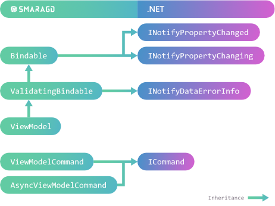

# 

This is a very lightweight library containing base classes for implementing .NET applications using the MVVM architecture.
It is fully unit tested and platform independent.

For an example project, please visit my other project [Stein](https://github.com/nkristek/Stein), where it is used in a WPF environment.

## Features

Smaragd offers base implementations of key .NET interfaces for building WPF / MVVM applications.

In addition, it enables developers to:

- Build dialog and tree structures via [`DialogModel`](https://github.com/nkristek/Smaragd/wiki/DialogModel) and [`TreeViewModel`](https://github.com/nkristek/Smaragd/wiki/TreeViewModel)
- Execute commands synchronously and asynchronously via [`ViewModelCommand`](https://github.com/nkristek/Smaragd/wiki/Commands) and [`AsyncViewModelCommand`](https://github.com/nkristek/Smaragd/wiki/Commands)
- Perform validation via [`FuncValidation`](https://github.com/nkristek/Smaragd/blob/master/src/Smaragd/Validation/FuncValidation.cs) and [`PredicateValidation`](https://github.com/nkristek/Smaragd/blob/master/src/Smaragd/Validation/PredicateValidation.cs)
- Manage state updates for interdependent properties via [`PropertySourceAttribute`](https://github.com/nkristek/Smaragd/wiki/ViewModel#propertysourceattribute)

For more information, please visit the [documentation](https://github.com/nkristek/Smaragd/wiki).

## Installation

The recommended way to use this library is via [Nuget](https://www.nuget.org/packages/NKristek.Smaragd/).

Currently supported frameworks:
- .NET Standard 2.0 or higher
- .NET Framework 4.5 or higher

## Quick Start

For most applications, it is recommended that viewmodels inherit from the [ViewModel](https://github.com/nkristek/Smaragd/blob/master/src/Smaragd/ViewModels/ViewModel.cs) base class ([more info](https://github.com/nkristek/Smaragd/wiki/ViewModel)), but if you only need an implementation for `INotifyPropertyChanged` (or `INotifyPropertyChanging`) you may use the [Bindable](https://github.com/nkristek/Smaragd/blob/master/src/Smaragd/ViewModels/Bindable.cs) base class ([more info](https://github.com/nkristek/Smaragd/wiki/Bindable)) instead. 

Commands may inherit from either [ViewModelCommand<>](https://github.com/nkristek/Smaragd/blob/master/src/Smaragd/Commands/ViewModelCommand.cs) or [AsyncViewModelCommand<>](https://github.com/nkristek/Smaragd/blob/master/src/Smaragd/Commands/AsyncViewModelCommand.cs) ([more info](https://github.com/nkristek/Smaragd/wiki/Commands)).

For an overview of the provided interfaces and classes please visit the [documentation](https://github.com/nkristek/Smaragd/wiki/Home#Overview).

## Why another MVVM library?

This library originated in my other project [Stein](https://github.com/nkristek/Stein) and was subsequently moved to its own repository and nuget package. The goal is to provide a great yet minimal foundation which also promotes a good code style. Nearly everything is marked virtual ([except events](https://msdn.microsoft.com/en-us/library/hy3sefw3.aspx)) so you can customize it to fit your needs.

And of course, this library is [🚀blazing fast🚀](https://twitter.com/acdlite/status/974390255393505280).

## Contribution

If you find a bug feel free to open an issue. Contributions are also appreciated.
